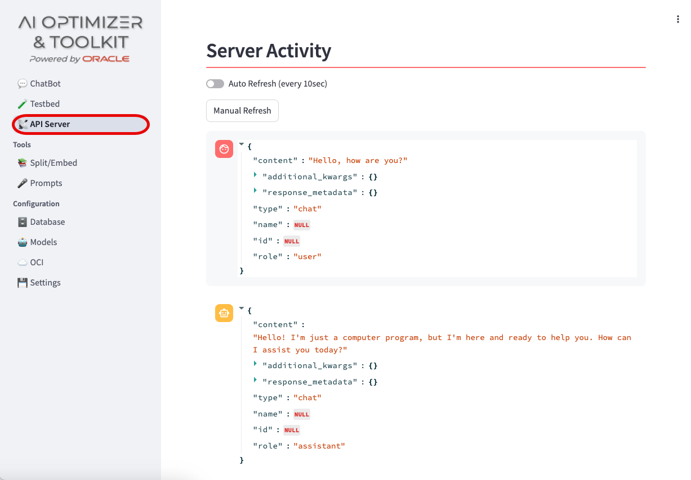

+++
title = '📡 API Server'
weight = 35
+++
<!--
Copyright (c) 2024, 2025, Oracle and/or its affiliates.
Licensed under the Universal Permissive License v1.0 as shown at http://oss.oracle.com/licenses/upl.
-->

The  is powered by an API Server to allow for any client to access its features.  The API Server can be run as part of the provided  GUI client or as a separate, independent process.  

Each client connected to the API Server, including those from the  GUI client, share the same configuration but maintain their own settings.  Database, Model, OCI, and Prompt configurations are used across all clients; but which database, models, OCI profile, and prompts set are specific to each client.

When started as part of the  client, you can change the Port it listens on and the API Server Key.  A restart is required for the changes to take effect.

If the API Server is started independently of the  client, the configuration is shown, but cannot be modified from the client.

## Server Configuration

During the startup of the API Server, a `server` client is created and populated with minimal settings.  The `server` client is the default when calling the API Server outside of the  GUI client.  To copy your  GUI client settings to the `server` client for use with external application clients, click the "Copy AI Explorer Settings".  

You can review how the `server` client is configured by expanding the `{...}` brackets.

## Server Activity

All interactions with the API Server using the `server` client can be seen in the Server Activity.  Toggle the "Auto Refresh" or manually refresh the Activity to see interactions from outside the  GUI client.

