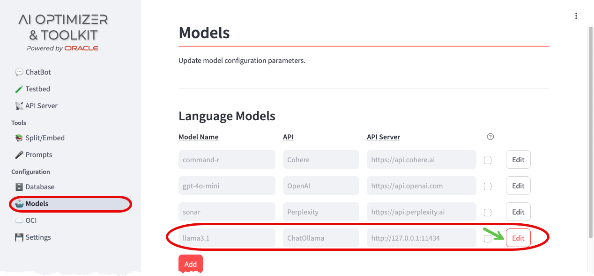
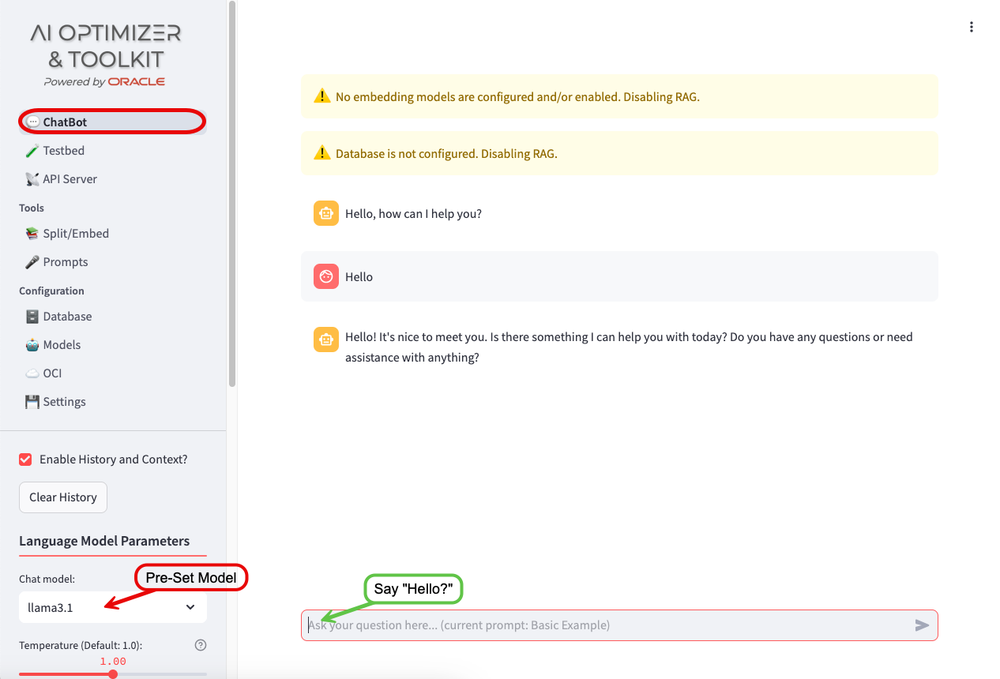
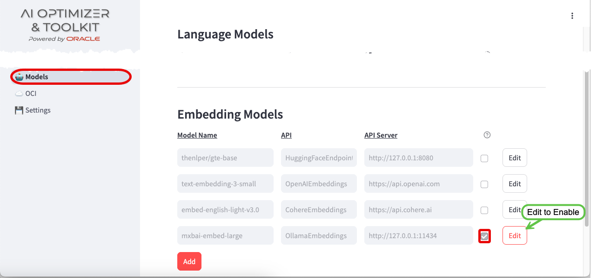
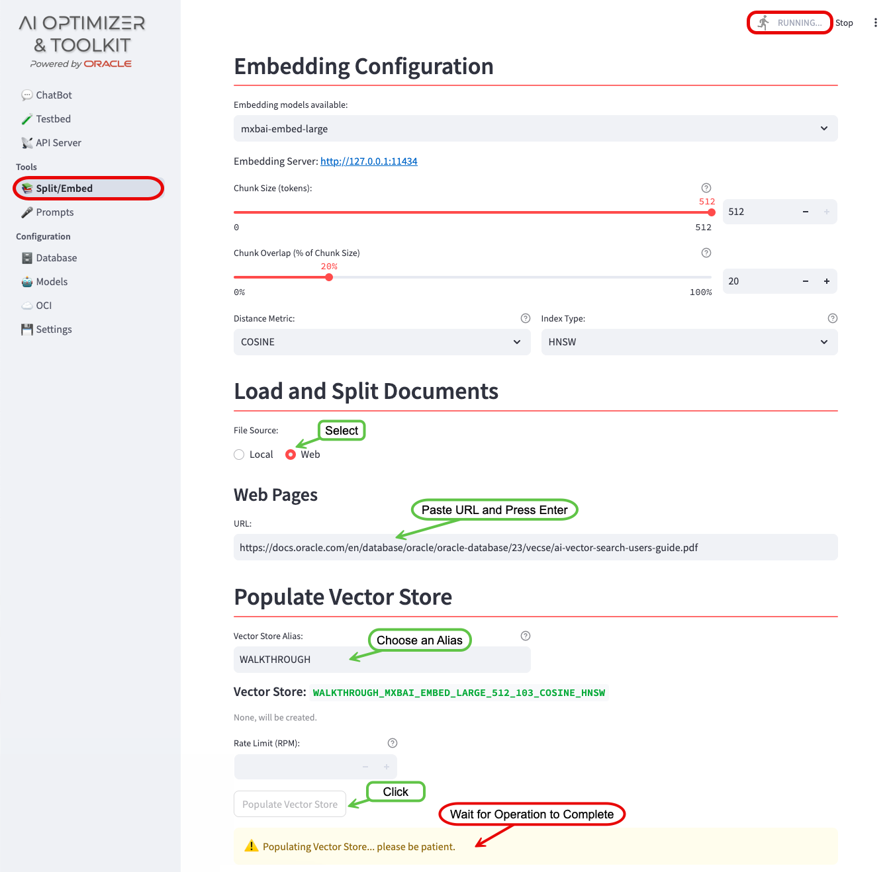
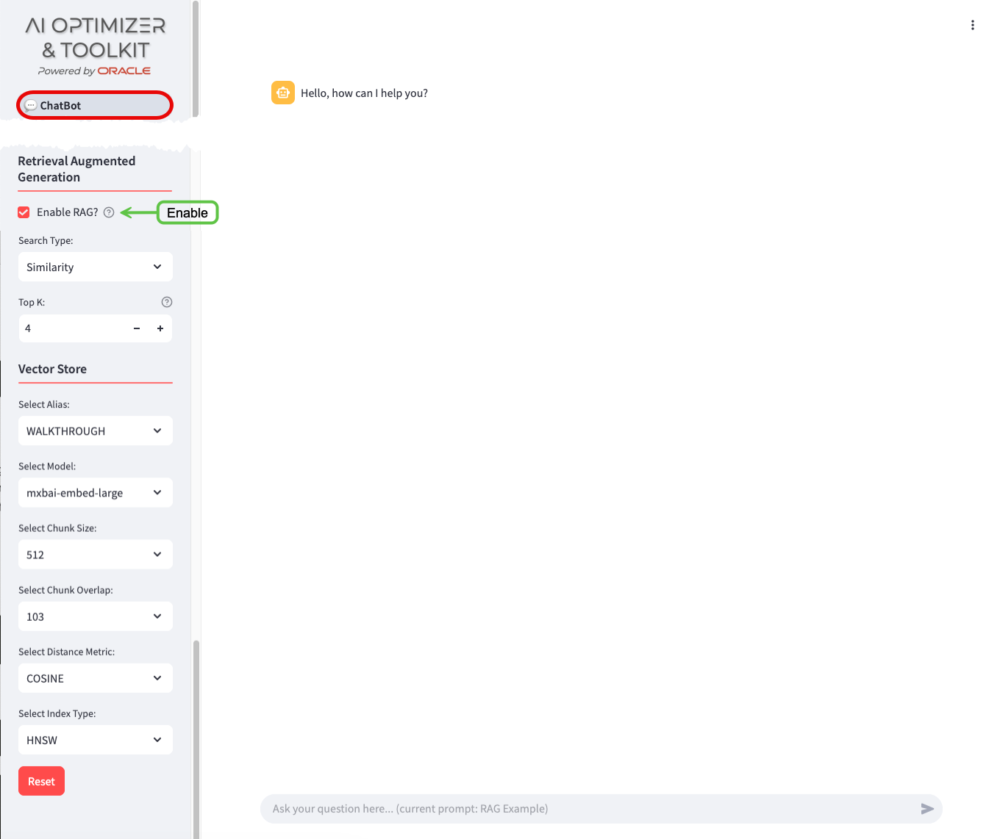

+++
title = 'Walkthrough'
menus = 'main'
weight = 5
+++

<!--
Copyright (c) 2024, 2025, Oracle and/or its affiliates.
Licensed under the Universal Permissive License v1.0 as shown at http://oss.oracle.com/licenses/upl.

spell-checker: ignore mxbai, ollama, oaim, sqlplus, sysdba, spfile, freepdb, tablespace, firewalld, hnsw
-->

This walkthrough will guide you through a basic installation of the . It will allow you to experiment with GenAI, using Retrieval-Augmented Generation (**RAG**) with Oracle Database 23ai at the core.

By the end of the walkthrough you will be familiar with:

- Configuring a Large Language Model (**LLM**)
- Configuring an Embedding Model
- Configuring the Vector Storage
- Splitting, Embedding, and Storing vectors for **RAG**
- Experimenting with the 

What you'll need for the walkthrough:

- Internet Access (docker.io and container-registry.oracle.com)
- Access to an environment where you can run container images (Podman or Docker).
- 100G of free disk space.
- 12G of usable memory.
- Sufficient GPU/CPU resources to run the **LLM**, embedding model, and database (see below).

{}
The performance will vary depending on the infrastructure.

**LLM**s and Embedding Models are designed to use GPUs, but this walkthrough _can work_ on machines with just CPUs; albeit _much_ slower!
When testing the **LLM**, if you don't get a response in a couple of minutes; your hardware is not sufficient to continue with the walkthrough.
{}

## Installation

{}
The walkthrough will reference `podman` commands. If applicable to your environment, `podman` can be substituted with `docker`.
If you are using `docker`, make the walkthrough easier by aliasing the `podman` command:

`alias podman=docker`.
{}

You will run four container images to establish the "Infrastructure":

- Vector Storage - Oracle Database 23ai Free
- On-Premises **LLM** - llama3.1
- On-Premises Embedding Model - mxbai-embed-large
- The 

### Vector Storage - Oracle Database 23ai Free

AI Vector Search in Oracle Database 23ai provides the ability to store and query private business data using a natural language interface. The  uses these capabilities to provide more accurate and relevant **LLM** responses via Retrieval-Augmented Generation (**RAG**). [Oracle Database 23ai Free](https://www.oracle.com/uk/database/free/get-started/) provides an ideal, no-cost vector store for this walkthrough.

To start Oracle Database 23ai Free:

1. Start the container:

   ```bash
   podman run -d --name oaim-db -p 1521:1521 container-registry.oracle.com/database/free:latest
   ```

1. Alter the `vector_memory_size` parameter and create a [new database user](../client/configuration/db_config#database-user):

   ```bash
   podman exec -it oaim-db sqlplus '/ as sysdba'
   ```

   ```sql
   alter system set vector_memory_size=512M scope=spfile;

   alter session set container=FREEPDB1;

   CREATE USER "WALKTHROUGH" IDENTIFIED BY OrA_41_EXPLORER
       DEFAULT TABLESPACE "USERS"
       TEMPORARY TABLESPACE "TEMP";
   GRANT "DB_DEVELOPER_ROLE" TO "WALKTHROUGH";
   ALTER USER "WALKTHROUGH" DEFAULT ROLE ALL;
   ALTER USER "WALKTHROUGH" QUOTA UNLIMITED ON USERS;
   EXIT;
   ```

1. Bounce the database for the `vector_memory_size` to take effect:

   ```bash
   podman container restart oaim-db
   ```

### LLM - llama3.1

To enable the _ChatBot_ functionality, access to a **LLM** is required. The walkthrough will use [Ollama](https://ollama.com/) to run the _llama3.1_ **LLM**.

1. Start the *Ollama* container:

   
   {}
   The Container Runtime is native:

   ```bash
   podman run -d --gpus=all -v ollama:$HOME/.ollama -p 11434:11434 --name ollama docker.io/ollama/ollama
   ```
   {}
   {}
   The Container Runtime is backed by a virtual machine.  The VM should be started with **12G memory** and **100G disk space** allocated.

   ```bash
   podman run -d -e OLLAMA_NUM_PARALLEL=1 -v ollama:$HOME/.ollama -p 11434:11434 --name ollama docker.io/ollama/ollama
   ```

   **Note:**
   AI Runners like Ollama, LM Studio, etc. will not utilize Apple Silicon's "Metal" GPU when running in a container. This may change as the landscape evolves.

   You can install and run Ollama natively outside a container and it will take advantage of the "Metal" GPU.  Later in the Walkthrough, when configuring the models, the API URL for the Ollama model will be your hosts IP address.

   {}
   {}
   The Container Runtime is backed by a virtual machine.  The VM should be started with **12G memory** and **100G disk space** allocated.

   ```bash
   podman run -d --gpus=all -v ollama:$HOME/.ollama -p 11434:11434 --name ollama docker.io/ollama/ollama
   ```

   **Note:**
   AI Runners like Ollama, LM Studio, etc. will not utilize non-NVIDIA GPUs when running in a container. This may change as the landscape evolves.

   You can install and run Ollama natively outside a container and it will take advantage of non-NVIDIA GPU.  Later in the Walkthrough, when configuring the models, the API URL for the Ollama model will be your hosts IP address.
   {}
   

1. Pull the **LLM** into the container:

   ```bash
   podman exec -it ollama ollama pull llama3.1
   ```

1. Test the **LLM**:

   {}
   Unfortunately, if the below `curl` does not respond within 5-10 minutes, the rest of the walkthrough will be unbearable.
   If this is the case, please consider using different hardware.
   {}

   ```bash
   curl http://127.0.0.1:11434/api/generate -d '{
   "model": "llama3.1",
   "prompt": "Why is the sky blue?",
   "stream": false
   }'
   ```

### Embedding - mxbai-embed-large

To enable the **RAG** functionality, access to an embedding model is required. The walkthrough will use [Ollama](https://ollama.com/) to run the _mxbai-embed-large_ embedding model.

1. Pull the embedding model into the container:

   ```bash
   podman exec -it ollama ollama pull mxbai-embed-large
   ```

### The 

The  provides an easy to use front-end for experimenting with **LLM** parameters and **RAG**.

1. Download and Unzip the latest version of the :

   ```bash
   curl -L -o oai-explorer.tar.gz https://github.com/oracle-samples/oaim-sandbox/archive/refs/heads/main.tar.gz
   mkdir oai-explorer
   tar zxf oai-explorer.tar.gz --strip-components=1 -C oai-explorer
   ```

1. Build the Container Image

   ```bash
   cd oai-client/src
   podman build --arch amd64 -t localhost/oai-explorer-aio:latest .
   ```

1. Start the :

   ```bash
   podman run -d --name oai-explorer-aio --network=host localhost/oai-explorer-aio:latest
   ```

   Operating System specific instructions:
   
   {}
   If you are running on a remote host, you may need to allow access to the `8501` port.

   For example, in Oracle Linux 8/9 with `firewalld`:

   ```bash
   firewall-cmd --zone=public --add-port=8501/tcp
   ```
   {}
   {}
   As the container is running in a VM, a port-forward is required from the localhost to the Podman VM:
   ```bash
   podman machine ssh -- -N -L 8501:localhost:8501
   ```
   {}
   {}


## Configuration

With the "Infrastructure" in-place, you're ready to configure the . 

In a web browser, navigate to `http://localhost:8501`:


Notice that there are no language models configured to use. Let's start the configuration.

### Configure the LLM

To configure the On-Premises **LLM**, navigate to the _Configuration -> Models_ screen:

1. Enable the `llama3.1` model that you pulled earlier by clicking the _Edit_ button

1. Tick the _Enabled_ checkbox, leave all other settings as-is, and _Save_

{} More information about configuring **LLM**s can be found in the [Model Configuration](../client/configuration/model_config) documentation.

#### Say "Hello?"

Navigate to the _ChatBot_ screen:



The error about language models will have disappeared, but there are new warnings about embedding models and the database. You'll take care of those in the next steps.

The `Chat model:` will have been pre-set to the only enabled **LLM** (_llama3.1_) and a dialog box to interact with the **LLM** will be ready for input.

Feel free to play around with the different **LLM** Parameters, hovering over the {} icons to get more information on what they do.

You'll come back to the _ChatBot_ later to experiment further.

### Configure the Embedding Model

To configure the On-Premises Embedding Model, navigate back to the _Configuration -> Models_ screen:

1. Enable the `mxbai-embed-large` Embedding Model following the same process as you did for the Language Model.


{}  More information about configuring embedding models can be found in the [Model Configuration](../client/configuration/model_config) documentation.

### Configure the Database

To configure Oracle Database 23ai Free, navigate to the _Configuration -> Database_ screen:

1. Enter the Database Username: `WALKTHROUGH`
1. Enter the Database Password for the database user: `OrA_41_EXPLORER`
1. Enter the Database Connection String: `//localhost:1521/FREEPDB1`
1. Save


{} More information about configuring the database can be found in the [Database Configuration](../client/configuration/db_config) documentation.

## Split and Embed

With the embedding model and database configured, you can now split and embed documents for use in **RAG**.

Navigate to the _Split/Embed_ Screen:

1. Change the File Source to `Web`
1. Enter the URL: 
   ```text
   https://docs.oracle.com/en/database/oracle/oracle-database/23/vecse/ai-vector-search-users-guide.pdf
   ```
1. Press Enter
1. Give the Vector Store an Alias: `WALKTHROUGH`
1. Click _Load, Split, and Populate Vector Store_
1. Please be patient...

{}
Depending on the infrastructure, the embedding process can take a few minutes. As long as the "RUNNING" dialog in the top-right corner is moving... it's working.
{}



{}
You can watch the progress of the embedding by streaming the logs: `podman logs -f oaim-explorer-aio`

Chunks are processed in batches. Wait until the logs output: `POST Response: <Response [200]>` before continuing.
{}

### Query the Vector Store

After the splitting and embedding process completes, you can query the Vector Store to see the chunked and embedded document:

From the command line:

1. Connect to the Oracle Database 23ai Database:

   ```bash
   podman exec -it oaim-db sqlplus 'WALKTHROUGH/OrA_41_EXPLORER@FREEPDB1'
   ```

1. Query the Vector Store:

   ```sql
   select * from WALKTHROUGH.WALKTHROUGH_MXBAI_EMBED_LARGE_512_103_COSINE_HNSW;
   ```

## Experiment

With the  configured, you're ready for some experimentation.

Navigate back to the _ChatBot_. There will be no more configuration warnings.

For this guided experiment, perform the following:

1. Ask the _ChatBot_:
   ```text
   In Oracle Database 23ai, how do I determine the accuracy of my vector indexes?
   ```

Responses may vary, but generally the _ChatBot_'s response will be inaccurate, including:

- Not understanding that 23ai is an Oracle Database release. This is known as knowledge-cutoff.
- Suggestions of running SELECTS, irrelevant DBMS or non-existent stored procedures, and maybe an ANALYZE. These are hallucinations.

Now enable _RAG?_ and simply ask: `Are you sure?`

{}
With **RAG** enabled, all the services (**LLM**/Embedding Models and Database) are being utilized simultaneously:

- The **LLM** is rephrasing "Are you sure?" into a query that takes into account the conversation history and context
- The embedding model is being used to convert the rephrased query into vectors for a similarity search
- The database is being queried for documentation chunks similar to the rephrased query (AI Vector Search)
- The **LLM** is grading the relevancy of the documents retrieved against the query
- The **LLM** is completing its response using the documents from the database (if the documents are relevant)

Depending on your hardware, this may cause the response to be **_significantly_** delayed.
{}



By asking `Are you sure?`, you are taking advantage of the 's history and context functionality.  
The response should be different and include references to `DBMS_VECTOR` and links to the embedded documentation where this information can be found. It might even include an apology!

## What's Next?

You should now have a solid foundation in utilizing the .
To take your experiments to the next level, consider exploring these additional bits of functionality:

- Turn On/Off/Clear history
- Experiment with different Large Language Models (LLMs) and Embedding Models
- Tweak LLM parameters, including Temperature and Penalties, to fine-tune model performance
- Investigate various strategies for splitting and embedding text data, such as adjusting chunk-sizes, overlaps, and distance metrics

## Clean Up

To cleanup the walkthrough "Infrastructure", stop and remove the containers.

```bash
podman container rm oaim-db --force
podman container rm oaim-explorer-aio --force
podman container rm ollama --force
```
